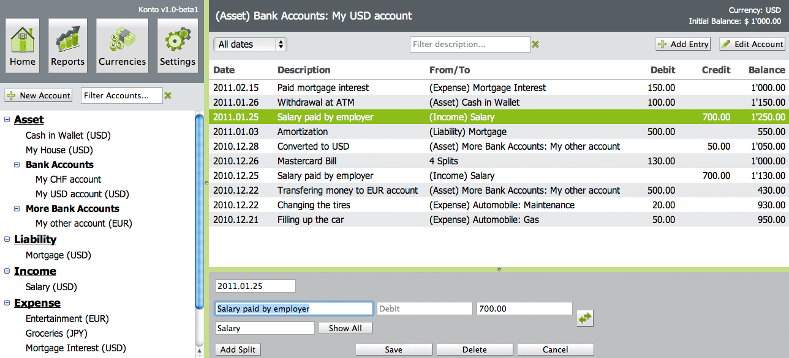

# Konto - AGPLv3 double-entry ledger accounting webapp

---

---

## Installation

[Download the latest web application release](https://github.com/4thline/konto/releases).

Get a Servlet 2.5 compatible container and deploy the WAR. An in-memory temporary H2 DBMS instance will be used.

If you want to use a permanent external H2 DBMS instance:

* Make directory for installation: `mkdir .local/`
* Download dependencies JAR files: `mvn dependency:copy-dependencies -DoutputDirectory=.local/lib`
* Run database: `java -jar .local/lib/h2-1.3.158.jar -tcp -tcpPort 9093 -baseDir $PWD/.local/`
* Unpack WAR and edit `WEB-INF/classes/hibernate.cfg.xml`
* Repack the WAR and deploy

You also might want to edit and deploy the `/sql/database-init-schema.sql` as needed, import it on your DBMS.

If you want to use a different database, recreate the SQL file(s) with `mvn package` after you edit the `src/main/resources/hibernate.cfg.xml` file.

## Development IDE setup

* Import in IntelliJ IDEA
* Create Run Configuration, build and deploy `konto:war exploded` artifact to Wildfly 10.x
* Run GWT SDM code server in background: `mvn gwt:codeserver`
* Open http://localhost:8080/
* Build release distribution with `mvn clean package`

